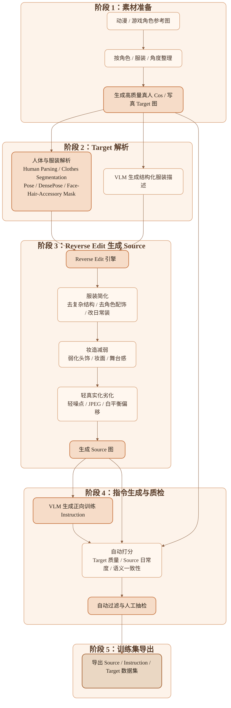

# 详细流程图

```mermaid
%%{init: {
  "theme": "base",
  "themeVariables": {
    "background": "#fffaf5",
    "primaryColor": "#f7e6d5",
    "primaryTextColor": "#2b2118",
    "primaryBorderColor": "#c97b49",
    "lineColor": "#8d6043",
    "secondaryColor": "#f9f3ec",
    "tertiaryColor": "#fff8f1",
    "fontFamily": "Microsoft YaHei, Segoe UI, sans-serif",
    "fontSize": "18px"
  },
  "flowchart": {
    "curve": "basis",
    "nodeSpacing": 40,
    "rankSpacing": 64
  }
}}%%
flowchart TD
    subgraph S1["阶段 1：素材准备"]
        direction TB
        A["动漫 / 游戏角色参考图"] --> B["按角色 / 服装 / 角度整理"]
        B --> C["生成高质量真人 Cos / 写真 Target 图"]
    end

    subgraph S2["阶段 2：Target 解析"]
        direction TB
        D["人体与服装解析<br/>Human Parsing / Clothes Segmentation<br/>Pose / DensePose / Face-Hair-Accessory Mask"]
        E["VLM 生成结构化服装描述"]
    end

    subgraph S3["阶段 3：Reverse Edit 生成 Source"]
        direction TB
        F["Reverse Edit 引擎"]
        F1["服装简化<br/>去复杂结构 / 去角色配饰 / 改日常装"]
        F2["妆造减弱<br/>弱化头饰 / 妆面 / 舞台感"]
        F3["轻真实化劣化<br/>轻噪点 / JPEG / 白平衡偏移"]
        G["生成 Source 图"]
        F --> F1 --> F2 --> F3 --> G
    end

    subgraph S4["阶段 4：指令生成与质检"]
        direction TB
        H["VLM 生成正向训练 Instruction"]
        I["自动打分<br/>Target 质量 / Source 日常度 / 语义一致性"]
        L["自动过滤与人工抽检"]
        H --> I --> L
    end

    subgraph S5["阶段 5：训练集导出"]
        direction TB
        M["导出 Source / Instruction / Target 数据集"]
    end

    C --> D
    C --> E
    D --> F
    E --> F
    G --> H
    C --> I
    G --> I
    L --> M

    classDef stage fill:#fdf3ea,stroke:#d9a37c,color:#5a3d2a,stroke-width:1.5px,rx:12,ry:12,font-size:24px,font-weight:bold;
    classDef core fill:#f6dcc8,stroke:#c97b49,color:#2b2118,stroke-width:2px,rx:12,ry:12;
    classDef process fill:#fff7ef,stroke:#d6a17a,color:#4a3427,stroke-width:1.5px,rx:10,ry:10;
    classDef final fill:#ead7c3,stroke:#a76536,color:#2b2118,stroke-width:2px,rx:12,ry:12;

    class S1,S2,S3,S4,S5 stage;
    class C,D,F,G,H,L core;
    class A,B,E,F1,F2,F3,I process;
    class M final;
```
