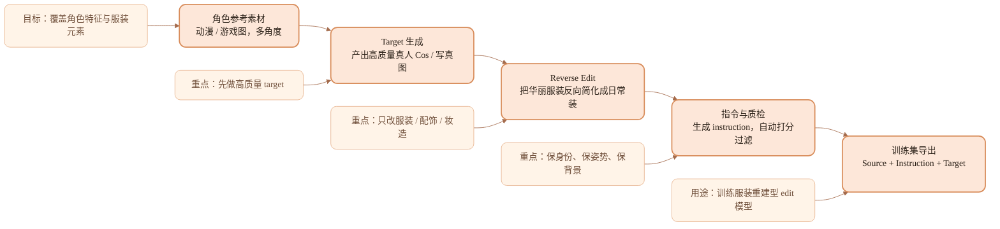
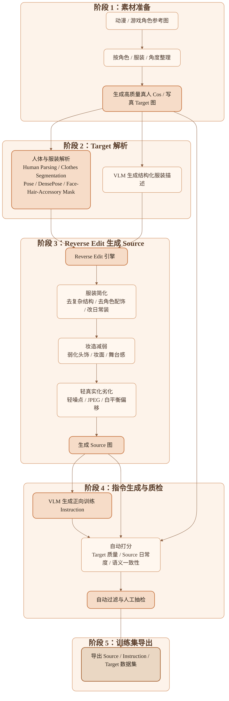

# 自动制作服装重建型 Edit 训练集方案 SPEC

## 1. 项目名称

**自动制作服装重建型（换装 + 美艳）Edit 训练集脚本**

## 2. 背景与目标

当前目标是建设一条可批量运行的数据生产链，用于生成适合训练图像编辑模型的成对样本：

- `target image`：高质量真人 cos / 写真服装成片
- `source image`：由 `target image` 反向劣化得到的“日常装扮 / 低华丽度 / 低妆造强度”输入图
- `instruction`：描述如何从 `source image` 编辑回 `target image` 的训练指令

该方案主要服务于以下训练目标：

- 让模型学习从日常装扮恢复到角色化、写真化、华丽化的服装外观
- 让模型尽可能保留人物身份、姿势、镜头、背景，只编辑服装与妆造
- 为各类 cos、写真、角色服装建立可扩展的自动化训练集生产能力

## 3. 核心定义

### 3.1 数据集类型

本项目的数据集不是普通图像修复集，也不是单纯超分/去噪集，而是：

**服装重建型（换装 + 美艳）Edit 数据集**

模型需要学习的能力包括：

- 将普通服装替换为指定角色或指定写真风格服装
- 增加服装层次、配饰、材质细节、剪裁复杂度
- 增强妆面、氛围感、成片质感
- 尽量不破坏人物脸、发型、姿势、构图和背景

### 3.2 样本定义

每条样本包含以下字段：

- `source_image`：输入图，偏日常服装、低华丽度
- `target_image`：目标图，高质量 cos / 写真成片
- `instruction`：正向编辑指令，从 `source -> target`
- `masks`：服装、配饰、头发、脸部、皮肤、背景等区域掩码
- `metadata`：角色、服装、机位、角度、质量评分等附加信息

## 4. 业务假设

当前方案基于以下业务假设：

- 已经可以批量获取一批动漫/游戏角色参考图，且尽量包含多角度、多景别
- 已经具备将参考图转换为真人 cos 图的能力，或计划接入该能力
- 可以调用 VLM 为 `target image` 生成结构化标签与描述
- 可以调用图像编辑/重绘模型，将 `target image` 定向反向编辑为 `source image`
- 训练侧更需要“同人同景但服装变化明显”的样本，而不是完全自由生成的数据

## 5. 总体方案

### 5.1 总体思路

采用 **Target-First Reverse Edit** 路线：

1. 先生产高质量 `target image`
2. 对 `target image` 做人体与服装解析
3. 仅在服装与妆造相关区域做“逆向简化”
4. 自动生成 `source image`
5. 用 VLM 生成从 `source` 回到 `target` 的训练指令
6. 通过自动打分与过滤，保留高质量成对样本

相比“一步 prompt 把 cos 图劣化成日常图”，该方案的优势是：

- 更容易保持人物身份一致
- 更容易保持姿势和背景一致
- 可控性更强，便于按服装部件做定向改写
- 更适合量产稳定的数据对

### 5.2 核心原则

- `source` 与 `target` 必须尽量同人、同姿势、同背景、同镜头
- 大变化尽量只发生在服装、配饰和妆造相关区域
- 训练指令必须描述正向目标，而不是描述逆向劣化过程
- 真实成像劣化只能是辅助，不应替代服装语义上的“简化”

## 6. 数据生产流水线

### 6.1 Stage A：角色参考图收集

输入：

- 动漫/游戏角色原图
- 官方立绘、CG、同人设定图、不同视角图

输出：

- `refs/character_id/*.png`

要求：

- 尽可能覆盖正面、侧面、背面、半身、全身
- 尽量按角色和服装形态分组
- 保留服装关键元素信息，例如发饰、袖口、裙摆、披肩、袜饰、鞋型、武器挂件

### 6.2 Stage B：真人 Cos Target 生成

输入：

- 角色参考图

输出：

- 高质量真人 cos / 写真风 `target image`

要求：

- 人体比例正常
- 角色特征与服装元素尽量齐全
- 构图完整，尽量少遮挡
- 优先保留可见服装全貌

推荐元信息：

- `character_id`
- `outfit_id`
- `view_angle`
- `shot_type`
- `style_type`

### 6.3 Stage C：Target 解析

输入：

- `target image`

处理内容：

- human parsing
- clothes segmentation
- dense pose / pose estimation
- face region detection
- hair region detection
- accessory region extraction
- background estimation

输出：

- 服装、头发、脸、皮肤、背景等 mask
- pose / densepose 信息

目的：

- 让后续逆向劣化只对指定区域生效
- 降低人物身份、姿势、背景一起漂移的概率

### 6.4 Stage D：Reverse Edit 生成 Source

这是整个流程的核心。

输入：

- `target image`
- 区域 mask
- 由 VLM 生成的服装结构描述

目标：

将高华丽度 cos / 写真服装反向编辑为普通日常装，形成 `source image`

Reverse Edit 建议拆成三类轴：

#### 轴 1：服装简化

- 去掉复杂层叠结构
- 去掉大部分角色配饰
- 降低材质复杂度
- 将特殊制服、铠甲、演出服、舞台服改写成常规日常服
- 将夸张裙摆、披风、吊带、翅膀、腿环、手套等改成简化版本或移除

#### 轴 2：妆造减弱

- 降低妆容精致度
- 减弱高光、唇妆、睫毛、舞台妆感
- 弱化发饰与头饰

#### 轴 3：轻真实化劣化

- 轻度手机成像感
- 轻度 JPEG 压缩
- 轻度噪点
- 轻度锐化过度或白平衡偏移

建议配比：

- `70%` 服装简化
- `20%` 妆造减弱
- `10%` 轻真实化劣化

不建议：

- 一步把整张图完全重生成新场景
- 大幅改变脸型、发型、体型、姿势
- 将背景也一起改掉

### 6.5 Stage E：VLM 生成训练指令

输入：

- `source image`
- `target image`
- 角色参考图
- 结构化属性描述

输出：

- 面向训练的正向 `instruction`

指令生成原则：

- 描述从普通装扮到目标 cos / 写真的转换
- 明确服装部件、颜色、材质、配饰、风格
- 尽量强调“保留人物和场景”
- 不描述“请把图变得更清晰”这类弱语义动作

示例：

> 保留人物脸部、发型、姿势和背景，把她换成黑白女仆风 cosplay，补上头饰、围裙、蕾丝袖口和长袜，并增强写真质感与妆容精致度。

### 6.6 Stage F：自动打分与过滤

需要对生成样本做自动筛选，避免低质量数据进入训练集。

推荐过滤维度：

- 人脸一致性分数
- 姿势一致性分数
- 背景一致性分数
- 服装变化幅度分数
- target 华丽度分数
- source 日常度分数
- 图像质量分数
- VLM 语义一致性分数

建议过滤规则：

- 身份漂移严重的样本剔除
- 姿势漂移严重的样本剔除
- source 仍然过于 cos 的样本剔除
- source 与 target 差异太小的样本剔除
- target 质量过低的样本剔除

### 6.7 Stage G：导出训练集

导出格式建议：

- 图片文件：`png` 或高质量 `jpg`
- 元数据：`jsonl`
- 可附加导出 `csv` 便于人工审核

样本结构建议：

```json
{
  "id": "char_021_outfit_03_view_02",
  "character_id": "char_021",
  "outfit_id": "maid_black_03",
  "source_image": "source/char_021_outfit_03_view_02.png",
  "target_image": "target/char_021_outfit_03_view_02.png",
  "instruction": "保留人物脸、发型、姿势和背景，把她换成黑白女仆风 cosplay，补上发饰、围裙、蕾丝袖口，并增强写真质感与妆容精致度。",
  "scores": {
    "face_similarity": 0.88,
    "pose_similarity": 0.94,
    "background_similarity": 0.91,
    "garment_change_score": 0.71,
    "source_casual_score": 0.78,
    "target_glamour_score": 0.84
  },
  "tags": [
    "cos",
    "maid",
    "full_body",
    "front_view"
  ]
}
```

## 7. 关键脚本模块设计

建议将项目拆成以下脚本模块：

### 7.1 `collect_refs`

功能：

- 收集和整理角色参考图
- 清洗重复图
- 标准化命名

### 7.2 `generate_target`

功能：

- 根据角色参考图生成真人 cos `target image`
- 记录角色、服装、角度和风格标签

### 7.3 `parse_target`

功能：

- 调用 human parsing、clothes segmentation、pose / densepose
- 产出可编辑 mask

### 7.4 `reverse_edit`

功能：

- 结合 mask 和属性描述进行服装逆向简化
- 生成 `source image`
- 控制改动区域与改动强度

### 7.5 `caption_and_instruction`

功能：

- 由 VLM 输出结构化描述
- 生成训练 instruction

### 7.6 `score_and_filter`

功能：

- 自动打分
- 过滤低质量样本
- 输出可审核列表

### 7.7 `export_dataset`

功能：

- 打包图片和 manifest
- 按训练、验证、测试集拆分

## 8. 推荐目录结构

```text
project/
  refs/
    char_001/
    char_002/
  target/
    images/
    metadata/
  parsed/
    masks/
    pose/
    densepose/
  source/
    images/
  manifests/
    train.jsonl
    val.jsonl
    test.jsonl
    review.csv
  scripts/
    collect_refs.py
    generate_target.py
    parse_target.py
    reverse_edit.py
    caption_and_instruction.py
    score_and_filter.py
    export_dataset.py
  configs/
    pipeline.yaml
  SPEC.md
  pipeline_flowchart.md
  framework_overview.md
```

## 9. 模型与 GitHub 参考

以下项目可作为“积木仓库”参考，而不是指望直接找到完全同构的现成工程。

### 9.1 编辑数据生成参考

- `timothybrooks/instruct-pix2pix`
  - 参考价值：成对 edit 样本和 instruction 组织方式
- `OSU-NLP-Group/MagicBrush`
  - 参考价值：图像编辑指令数据集定义和评估思路

### 9.2 服装编辑 / 换装参考

- `Zheng-Chong/CatVTON`
  - 参考价值：服装编辑预处理链、agnostic mask、densepose 相关做法
- `levihsu/OOTDiffusion`
  - 参考价值：经典 virtual try-on 数据组织方式
- `rizavelioglu/tryoffdiff`
  - 参考价值：virtual try-off 方向，和本方案的“逆向简化”最接近
- `aimagelab/multimodal-garment-designer`
  - 参考价值：更贴近 fashion editing
- `rlawjdghek/PromptDresser`
  - 参考价值：prompt 驱动服装控制

### 9.3 人体解析与区域控制参考

- `GoGoDuck912/Self-Correction-Human-Parsing`
- `levindabhi/cloth-segmentation`

### 9.4 真实劣化参考

- `XPixelGroup/BasicSR`
  - 参考价值：轻度真实图像退化策略，可作为 source 端辅助手段

## 10. 质量标准

### 10.1 样本级标准

- `target` 应明显强于 `source` 的服装复杂度和妆造强度
- `source` 必须看起来合理，不应变成破图或不可用图
- 两图必须尽量同人、同姿势、同构图、同背景
- `instruction` 必须能准确描述需要补回的服装和风格元素

### 10.2 数据集级标准

- 覆盖多角色、多服装、多角度、多景别
- 不同角色之间风格不要过度单一
- 不同 source 劣化策略要有一定多样性
- 避免训练集被少数角色和少数服装类型主导

## 11. 风险与难点

### 11.1 最大风险

- 一步逆向编辑导致人物身份漂移
- 服装简化不充分，source 仍然过于 cos
- 过度劣化导致 source 失真，训练目标偏掉
- 指令文本过于空泛，无法有效监督模型
- 数据分布失衡，模型只会少数服装模板

### 11.2 对应缓解策略

- 必须使用局部 mask 控制，而不是整图自由重绘
- 增加自动过滤和人工 spot check
- 用结构化标签生成 instruction，而不是完全自由描述
- 将服装简化模板按品类拆分，例如制服、礼服、女仆、JK、战斗服、泳装、舞台服
- 数据拆分按 `character_id` 或 `outfit_id` 做隔离，避免泄漏

## 12. MVP 建议

建议先做一个最小可行版本，避免前期系统过重。

### 12.1 MVP 范围

- 只做 2 到 3 个服装大类
- 只做全身或半身两个主要景别
- 先不追求全部自动化，允许部分人工审核
- 先跑通 `target -> parse -> reverse_edit -> instruction -> export`

### 12.2 MVP 成功标准

- 能稳定产出至少 `1,000` 条可训练样本
- 样本中大部分可以明显看出“日常 -> cos / 写真重建”关系
- 自动过滤后保留率可接受
- 人工抽检时，大部分样本的身份与姿势保持稳定

## 13. 里程碑建议

### Phase 1：技术验证

- 选定 2 个角色、2 类服装
- 跑通完整闭环
- 验证 reverse edit 是否能稳定保持身份和姿势

### Phase 2：自动化扩展

- 接入批处理
- 接入自动打分与过滤
- 累积到数千条样本

### Phase 3：数据集工程化

- 完成配置化和任务调度
- 建立 review 流程
- 形成可重复运行的数据生产线

## 14. 简易框架图

这张图用于汇报首页，帮助快速说明整套方案的核心逻辑：



## 15. 详细流程图

这张图用于技术汇报正文，展示数据生产闭环和关键控制点：



## 16. 汇报结论

本项目最优路径不是“直接把 cos 图粗暴劣化成普通图”，而是：

**先生产高质量 target，再通过局部可控的 reverse edit 生成 source，最后自动生成正向 instruction 并做过滤。**

该路线的优势在于：

- 更符合服装重建型 edit 的训练目标
- 更利于保持身份、姿势和背景稳定
- 更适合工程化和批量扩展
- 更容易形成可以持续迭代的数据工厂
