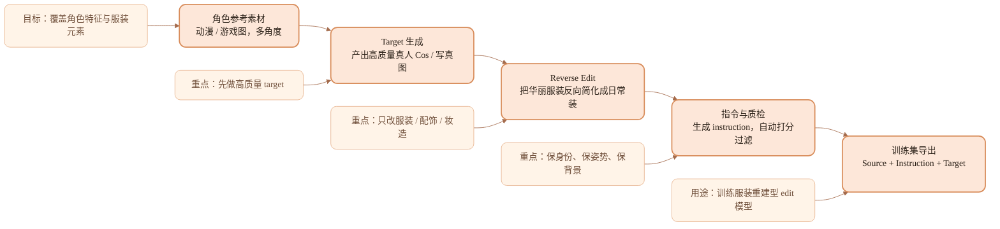

# 简易框架图

```mermaid
%%{init: {
  "theme": "base",
  "themeVariables": {
    "background": "#fffaf5",
    "primaryColor": "#fde7d9",
    "primaryTextColor": "#2b2118",
    "primaryBorderColor": "#d88c5a",
    "lineColor": "#a46b4c",
    "secondaryColor": "#f6efe7",
    "tertiaryColor": "#fff7ef",
    "fontFamily": "Microsoft YaHei, Segoe UI, sans-serif"
  },
  "flowchart": {
    "curve": "basis",
    "nodeSpacing": 42,
    "rankSpacing": 50
  }
}}%%
flowchart LR
    A["角色参考素材<br/>动漫 / 游戏图，多角度"] --> B["Target 生成<br/>产出高质量真人 Cos / 写真图"]
    B --> C["Reverse Edit<br/>把华丽服装反向简化成日常装"]
    C --> D["指令与质检<br/>生成 instruction，自动打分过滤"]
    D --> E["训练集导出<br/>Source + Instruction + Target"]

    A1["目标：覆盖角色特征与服装元素"] --> A
    B1["重点：先做高质量 target"] --> B
    C1["重点：只改服装 / 配饰 / 妆造"] --> C
    D1["重点：保身份、保姿势、保背景"] --> D
    E1["用途：训练服装重建型 edit 模型"] --> E

    classDef core fill:#fde7d9,stroke:#d88c5a,color:#2b2118,stroke-width:2px,rx:12,ry:12;
    classDef note fill:#fff4e8,stroke:#e7b38d,color:#6d4c37,stroke-width:1px,rx:10,ry:10;
    class A,B,C,D,E core;
    class A1,B1,C1,D1,E1 note;
```
